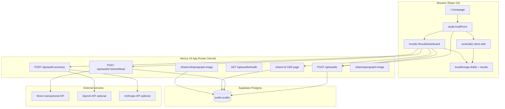

# CreditFlow — System Architecture

CreditFlow is a Next.js 16 web application that runs a **deterministic, rule-based AI spend audit** on user-supplied tool inputs, persists results in Supabase, exposes **unguessable share URLs** for public reports, and sends **transactional follow-up email** via Brevo after optional lead capture. Financial math and recommendations never come from an LLM; AI is used only for an optional executive narrative on the private results page.

**Production deployment:** https://creditflow-audit.vercel.app

---

## Assignment scope (Credex)

Credex deliverables implemented in this repo, cross-checked against the running code:

| Requirement area | Implemented | Where |
|------------------|-------------|--------|
| Audit form (multi-tool, zod + RHF) | Yes | `/audit`, `src/components/audit/`, `src/lib/audit-schema.ts` |
| Tool + dynamic plan dropdowns | Yes | `ToolEntryCard`, `src/data/pricing/catalog.ts` |
| Rule-based audit engine (no AI math) | Yes | `src/lib/audit-engine/` |
| Pricing dataset | Yes | `src/data/pricing/` |
| Results dashboard | Yes | `/results`, `ResultsDashboard` |
| localStorage draft + results | Yes | `src/lib/audit-storage.ts` |
| Supabase persistence + `share_id` | Yes | `POST /api/audits`, `src/lib/audits/repository.ts` |
| Public share report `/share/[id]` | Yes | `src/app/share/[id]/page.tsx` |
| Lead capture (email required) | Yes | `LeadCaptureSection`, `POST /api/audits/[shareId]/lead` |
| Transactional email | Yes (Brevo) | `src/lib/email/send-audit-summary.ts` |
| Share link UX (copy, open, social intents) | Yes | `ShareReportActions` |
| Dynamic OG + Twitter metadata | Yes | `buildPublicShareMetadata`, `generateMetadata` |
| Dynamic + static OG images | Yes | `/share/[id]/opengraph-image`, `/share/opengraph-image` |
| Privacy: no lead data on public surfaces | Yes | Public page + metadata builders |
| AI executive summary (optional) | Yes | `POST /api/audit-summary`, private results only |
| Honeypot anti-spam | Yes | `website` field on audit + lead APIs |
| Demo / testing data | Partial | `/results?demo=1` + `audit-demo-scenarios.ts`; no “Load Demo Data” on `/audit` |
| User accounts / login | No | No auth layer; share link is the access model |
| Downloadable audit PDF | No | Reports are web share URLs + email, not PDF files |
| Referral program | No | No invite/reward flow |
| Embeddable report widget | No | No iframe or third-party embed API |

---

## System diagram



---

## End-to-end data flow

### 1. Audit submission (happy path)

1. User completes `/audit` (`AuditForm`: team size + one or more tool rows).
2. **Client** runs `runAudit()` in `src/lib/audit-engine/index.ts`:
   - `sanitizeAuditInput` / `validateAuditCombinations`
   - per-tool `evaluateTool` → rule pipeline → `finalizeRecommendation`
   - stack overlap detection via `detectStackOverlaps` (`src/data/pricing/overlap.ts`)
3. If `invalidToolCount > 0`, submit is blocked with an error (no navigation).
4. On success: `saveAuditResults`, `saveAuditInput` to **localStorage**; `POST /api/audits` with `{ auditData, resultData }`.
5. Server validates with `createAuditSchema` (zod), generates 12-char `share_id` (`generateShareId`), inserts row via **service-role** Supabase client, returns `{ shareId }`.
6. Client stores `shareId`, navigates to `/results?share=…`.

If Supabase is misconfigured, the audit still completes locally and the user is sent to `/results` with an error message (degraded mode).

### 2. Private results

1. `ResultsDashboard` hydrates from localStorage (and `?share=` if present).
2. If results exist but no `shareId`, it retries `persistAuditToServer` once.
3. `AuditResultsView` renders engine output; `showAiSummary={true}` mounts `AuditAiSummary`.
4. `fetchAuditSummary` → `POST /api/audit-summary` with full `AuditResult`; response cached in **sessionStorage** by `generatedAt`. On failure, deterministic `buildFallbackSummary` is used client- and server-side.
5. When `shareId` exists: `ShareReportActions` + `LeadCaptureSection`.

### 3. Lead capture + email

1. User submits email (optional company, role) **after** seeing results (value-first).
2. `POST /api/audits/[shareId]/lead` updates `email`, `company_name`, `role` on the audit row.
3. `sendAuditSummaryEmail(row)` via Brevo; API returns `emailSent` / `emailStatus` without failing the lead save if email is skipped or fails.

### 4. Public share + social preview

1. Anyone with `https://…/share/{shareId}` hits SSR `SharePage`.
2. `getAuditByShareId` loads row; page renders `result_data` only — **no** `audit_data` form fields, **no** lead columns.
3. `generateMetadata` uses `buildPublicShareMetadata` (aggregate savings, team size, tool count — never email/company).
4. Crawlers request `/share/{id}/opengraph-image` (`next/og` `ImageResponse`); static fallback at `/share/opengraph-image`.

### 5. Demo mode (no persistence)

- `/results?demo=1` loads `buildDemoAuditResult()` (scenario: `overspending_startup` only).
- No `shareId`, no lead capture, no server persist.

---

## Application structure

```
src/
├── app/                    # Routes + Route Handlers
│   ├── page.tsx            # Marketing homepage
│   ├── audit/page.tsx
│   ├── results/page.tsx
│   ├── share/[id]/         # Public report + OG image
│   └── api/
│       ├── audits/         # Create + health
│       ├── audits/[shareId]/lead/
│       └── audit-summary/
├── components/
│   ├── audit/              # Form UI
│   ├── homepage/           # Marketing sections
│   └── results/            # Dashboard, share, lead, AI summary
├── data/pricing/           # Catalog, overlap groups, helpers
├── lib/
│   ├── audit-engine/       # Deterministic recommendations
│   ├── audit-summary/      # LLM narrative + fallback
│   ├── audits/             # Repository, schemas, share IDs
│   ├── email/              # Brevo + HTML template
│   ├── share/              # URLs, metadata, OG layout
│   ├── security/           # sanitize, share ID validation
│   └── supabase/           # Server + browser clients, env diagnostics
└── types/                  # audit.ts, database.ts
supabase/migrations/        # audits table + RLS policies
```

### Pages

| Route | Rendering | Purpose |
|-------|-----------|---------|
| `/` | Static/marketing | Homepage CTAs → `/audit`, demo links |
| `/audit` | Client form | Collect inputs, run engine, persist |
| `/results` | Client dashboard | Private results, AI summary, share, lead |
| `/share/[id]` | **Server** | Public report, metadata, OG |
| `/share/[id]/opengraph-image` | **Server** | Dynamic social image |
| `/share/opengraph-image` | **Server** | Static fallback image |

### API routes

| Method | Path | Role |
|--------|------|------|
| `POST` | `/api/audits` | Insert audit; honeypot `website`; requires Supabase service role |
| `GET` | `/api/audits/health` | Env diagnostics (no secrets) |
| `POST` | `/api/audits/[shareId]/lead` | Update lead fields + trigger Brevo |
| `POST` | `/api/audit-summary` | Generate AI or fallback summary from `AuditResult` |

There are **no** Server Actions for audits; persistence uses Route Handlers only.

---

## Audit engine (source of truth)

All savings numbers are computed in the browser (and re-validated on the server only as structured JSON, not recomputed).

**Pipeline per tool:**

1. `buildEvalContext` — resolve catalog tier from `planTierId`, benchmark spend.
2. If plan/spend invalid → `buildInvalidEntryRecommendation` (zero claimed savings).
3. Else `runRulePipeline` — rules for overprovisioned enterprise/team tiers, small teams, API usage patterns, alternatives, credits, already-optimized paths (`src/lib/audit-engine/rules.ts`).
4. `finalizeRecommendation` — monthly/annual savings, priority, reasoning, action items.

**Catalog:** `TOOL_CATALOG` in `src/data/pricing/catalog.ts` defines tiers (per-seat, flat, API), aliases, and alternatives for nine tool IDs (`SUPPORTED_TOOL_IDS`).

**Overlaps:** `OVERLAP_GROUPS` flag redundant IDE assistants, chat workspaces, and dual LLM APIs when combined spend exceeds thresholds.

**Trust copy:** `trustNote` and `summaryMessage` on `AuditResult` reinforce directional estimates.

---

## Persistence layer

### Schema (`public.audits`)

| Column | Type | Usage |
|--------|------|--------|
| `id` | `uuid` | Primary key |
| `share_id` | `text` unique | Public URL identifier (12 alphanumeric) |
| `audit_data` | `jsonb` | Raw form (`AuditFormValues`) — **not shown on public page** |
| `result_data` | `jsonb` | `AuditResult` — shown on public + private views |
| `estimated_savings` | `jsonb` | `{ monthly, annual, rate_percent }` for OG/email |
| `email`, `company_name`, `role` | nullable text | Lead capture only |
| `created_at` | `timestamptz` | Insert time |

Indexes: `share_id`, `created_at desc`.

### Access pattern

- **All server writes/reads** use `createServerSupabase()` with `SUPABASE_SERVICE_ROLE_KEY` (session disabled).
- `createBrowserSupabase()` exists but is **not** used in the audit flow; the browser never talks to Supabase directly for audits.
- RLS is enabled with:
  - `Public read by share_id` (select when `share_id is not null`)
  - Migration `002`: anon/authenticated insert + update (MVP; service role bypasses RLS)

**Implication:** `POST /api/audits` trusts client-supplied `resultData`. The server does not re-run `runAudit()`. Tampering could inflate savings in stored JSON until server-side recomputation is added.

---

## AI summary layer (narrative only)

| Concern | Implementation |
|---------|----------------|
| Input | Full `AuditResult` JSON |
| Facts | `buildSummaryContext` — dollar amounts and tool names from engine output only |
| Providers | OpenAI SDK or Anthropic fetch; `CREDITFLOW_AI_PROVIDER` preference |
| Validation | `isValidAiSummary` — word count 80–120, no hallucinated dollar figures |
| Failure | `buildFallbackSummary` (deterministic analyst tone) |
| Visibility | `showAiSummary={false}` on `/share/[id]` |

---

## Share, metadata, and privacy boundary

**Public-safe fields:** `result_data` aggregates, `estimated_savings`, derived copy in `buildPublicShareDescription` / `getPublicSavingsLabel`.

**Never on `/share/[id]` or OG/Twitter tags:** `email`, `company_name`, `role`, raw `audit_data` (seat-level form detail beyond what’s already in recommendations).

**Canonical URLs:** `NEXT_PUBLIC_APP_URL` → `getAppOrigin()` for metadata, email links, and production share copy.

**OG images:** `ShareOgImageContent` in `src/lib/share/og-image.tsx` (Credex palette); per-share headline from savings label.

---

## Email (Brevo)

- Template: `buildAuditSummaryEmail` — subject, HTML, plain text with savings headline + share URL CTA.
- Send path: `BrevoClient.transactionalEmails.sendTransacEmail`.
- If `BREVO_*` env vars missing: lead API still succeeds; `emailSent: false`, `emailStatus: skipped_not_configured`.
- **Historical note:** DEVLOG records an earlier Resend integration; production code uses Brevo only (`@getbrevo/brevo` in `package.json`).

---

## Security (MVP)

| Control | Location |
|---------|----------|
| Zod validation | API bodies, forms |
| `sanitizeText` / `sanitizeEmail` | Lead updates |
| `isValidShareId` | Repository lookups |
| Honeypot `website` | Returns fake success if filled (`/api/audits`, lead route) |
| Service role server-only | Never exposed to client bundle |
| No authentication | Share link = capability URL |

**Not implemented:** rate limiting, CAPTCHA, server-side audit recomputation, strict RLS (public read is broad), audit retention/deletion APIs.

---

## Why Next.js + Supabase + Brevo

### Next.js 16 (App Router)

- **Colocation:** Marketing pages, client-heavy audit/results, SSR share routes, and OG image routes in one deployable unit on Vercel.
- **`generateMetadata` + `opengraph-image.tsx`:** Native support for per-share social cards without a separate image service.
- **Route Handlers:** Simple JSON APIs for persist, lead, and AI summary without standing up another backend service.
- **React Compiler** (`reactCompiler: true` in `next.config.ts`): Aligns with current Next toolchain used in the project.

Chosen over a separate SPA + API split because the assignment lifecycle (form → results → share → OG crawlers) maps cleanly to App Router segments and edge-friendly static + dynamic rendering.

### Supabase (Postgres)

- **JSONB columns** fit evolving `AuditResult` / form shapes without migrations per engine tweak.
- **Unique `share_id`** with cheap indexed lookups for public pages and OG generation.
- **Managed Postgres** on Vercel avoids operating a database for an MVP submission scope.
- **Service role** keeps client bundle free of write credentials while still allowing a future anon-key read path via existing RLS policies.

Chosen over MongoDB (`mongodb` is listed in `package.json` but **unused** in `src/`) because relational constraints (unique share IDs, lead updates by key) are straightforward in SQL.

### Brevo (transactional email)

- **DEVLOG constraint:** Resend test mode blocked real delivery without a verified domain; Brevo was integrated with working API delivery in the author’s environment.
- **Minimal swap:** Only `send-audit-summary.ts` changed; templates and lead route stayed stable.
- **Transactional API** sufficient for single “audit ready” messages (no marketing automation required).

---

## Scaling toward 10,000 audits/day

Rough load: **10k audits/day ≈ 0.12 writes/sec average**, with higher peaks if traffic is bursty. The architecture is lightly loaded at that volume; bottlenecks appear in **peaks**, **crawler traffic**, and **email**, not in the rule engine (client-side).

| Layer | At ~10k/day | Risks / mitigations |
|-------|-------------|---------------------|
| **Audit compute** | Runs in browser | Server CPU negligible; optional move `runAudit()` to API if tamper-proofing is required |
| **`POST /api/audits`** | ~10k inserts | Supabase plan connection limits; batch off-peak if needed; index `share_id` already exists |
| **Postgres storage** | ~10k JSONB rows/day | ~3M rows/year — monitor disk; add retention job (not implemented) |
| **Vercel functions** | Low CPU per request | Cold starts on lead/email; consider regional pinning; watch 10s timeout on slow Brevo calls |
| **OG image routes** | Crawler-driven, spiky | Each Slack/LinkedIn preview may hit `/share/[id]/opengraph-image`; cache at CDN (Vercel `ImageResponse` caching headers), or pre-render popular shares |
| **`POST /api/audit-summary`** | Optional, user-triggered | OpenAI/Anthropic rate limits and cost dominate; keep fallback default; queue + worker if summaries become mandatory |
| **Brevo** | ≤10k emails/day if every lead converts | Verify plan sending limits; async queue (SQS/Supabase queue) between lead API and send |
| **Share ID collisions** | Rare | 62^12 space; 3 retry loop on `23505` sufficient |

**Recommended production hardening before high volume:**

1. Recompute `runAudit(audit_data)` on server before insert; reject mismatched `resultData`.
2. Tighten RLS: public `SELECT` only where `share_id = $1` (parameterized), not all rows.
3. Rate limit by IP on `/api/audits` and lead routes.
4. Add `Cache-Control` on OG routes; optional object storage for rendered PNGs.
5. Background worker for Brevo sends decoupled from lead HTTP response.

---

## Explicitly not in this codebase

- User authentication / org accounts
- OAuth or invoice ingestion (“Connect your AI stack” on homepage is **marketing copy** only)
- Server-side recomputation of audit results on persist
- PDF export, referral program, embeddable widget, benchmark leaderboard
- CI test suite in repo scripts (`npm run lint` only)
- “Load Demo Data” button on `/audit` (scenarios exist in `audit-demo-scenarios.ts` but only `overspending_startup` is wired via `/results?demo=1`)
- MongoDB usage despite dependency entry
- Resend (removed; Brevo only)

---

## Environment variables

| Variable | Required | Role |
|----------|----------|------|
| `NEXT_PUBLIC_APP_URL` | Yes (production) | Canonical origin for share links, OG, email |
| `NEXT_PUBLIC_SUPABASE_URL` | Yes | Supabase project |
| `NEXT_PUBLIC_SUPABASE_PUBLISHABLE_KEY` | Yes | Browser client (unused in main flow) |
| `SUPABASE_SERVICE_ROLE_KEY` | Yes | Server persistence |
| `BREVO_API_KEY`, `BREVO_SENDER_NAME`, `BREVO_SENDER_EMAIL` | For email | Transactional send |
| `CREDITFLOW_AI_PROVIDER`, `OPENAI_*`, `ANTHROPIC_*` | Optional | AI executive summary |

See `.env.example` for names and aliases.

---

## Assumptions made

1. **Share links are unlisted, not secret:** possession of `share_id` grants read access; security is obscurity + no indexing of invalid links (`robots` on 404 metadata only).
2. **Deployed production** matches `README.md`: Vercel app at `creditflow-audit.vercel.app` with env vars configured.
3. **Supabase migrations** `001_audits.sql` and `002_audits_rls_insert.sql` have been applied in the hosted project.
4. **Brevo sender** domain is authorized in the operator’s Brevo account (IP/domain restrictions are an ops concern, not app logic).

---

## Related documentation

- `README.md` — setup, features, trade-offs, preview testing pointers
- `DEVLOG.md` — build chronology (Resend → Brevo, Supabase integration notes)
- `supabase/migrations/` — schema and RLS source of truth
