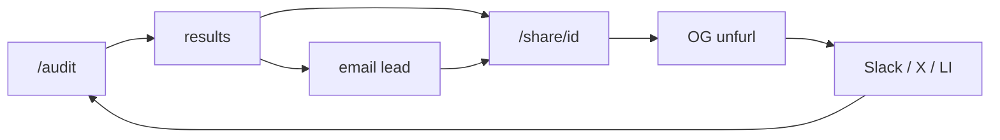

# CreditFlow — Go-to-market

CreditFlow is a free, no-login audit for startups bleeding money on AI tools. You fill out `/audit` by hand (team size, tools, plans, rough usage). A rule-based engine—not ChatGPT—does the math, saves to Supabase, and gives you a public link at `/share/[id]` with a real Open Graph preview (savings number, team size, spend). Email capture happens on `/results` *after* you see the report.

**Live:** https://creditflow-audit.vercel.app  
**Demo:** https://youtu.be/LPFzV2b-xyA

Built for Credex-style deliverables: shareable report, OG/Twitter cards, lead capture, no lead data on the public page. Not built: auth, PDF export, referrals, embeds, billing integrations.

---

## Who I'd actually target

One person, not a buying committee: **Head of Engineering or technical co-founder** at an **8–35 person** post-seed / Series A shop. They personally bought ChatGPT Team, Cursor Business, maybe API keys on the corp card. Finance is asking “why is AI $4k/month?” and they do not have a FinOps person.

They overlap tools (Cursor + Copilot), sit on the wrong tier, and need something they can **paste in Slack** that finance can open without a demo call. If they say “I’ll just use a spreadsheet,” the answer is: this runs overlap/downgrade rules off a pricing catalog and gives you a link with a preview card—not a vibe check from Claude.

Secondary: a **fractional CFO** who runs the same form for a few clients and drops `/share/[id]` into monthly updates. There’s no multi-tenant product; they just reuse the free tool.

Skip for now: enterprise procurement, agencies, teams with no AI spend, anyone who needs SSO before touching a form.

---

## What ships today

- **Audit form** — up to 12 tools, zod validation; nine vendors (Cursor, Copilot, Claude, ChatGPT, Anthropic/OpenAI API, Gemini, Windsurf, v0).
- **Engine** — downgrades, alternatives, stack overlap (`runAudit`, `catalog.ts`, `overlap.ts`). All dollar amounts come from here.
- **Private `/results`** — full breakdown; optional AI executive summary if API keys are set (private only).
- **Public `/share/[id]`** — same numbers, no email or company name on the page.
- **OG + Twitter cards** — per-report image at `/share/[id]/opengraph-image`; description built from aggregates only.
- **Share UX** — copy link, native share, intents for X, LinkedIn, WhatsApp (`ShareReportActions`).
- **Lead + Brevo** — work email after results; email includes share link (skips gracefully if Brevo isn’t configured).
- **Degraded mode** — audit still runs in the browser if Supabase is down; localStorage holds you until persist works.

**Don’t sell yet:** invoice import, auto-connect to vendors, squad analytics, PDF, accounts, referrals. The homepage “34% avg savings” line is marketing copy—not something the app computes across users. In posts, use *your* savings from the share card, not hero stats.

---

## The growth loop (already in the product)



This is the whole GTM bet. Someone runs an audit, gets a `shareId`, hits share. `ShareReportActions` pre-fills something like “Saved $X/year on AI tooling with CreditFlow” when there are savings. The link unfurls with dynamic title/image—recipient clicks the public report, sees the CTA, runs their own audit.

Second loop: they leave an email, Brevo sends the summary + same link. Forwarded email = another unfurl.

Third loop (founder-led): **See Demo** on the homepage → YouTube, or `/results?demo=1` on a call/tweet, then push people to `/audit` for real numbers.

Gaps worth knowing: no “load demo data” on the audit form yet; no in-app analytics on share clicks—tag links yourself with UTMs if you care.

---

## How I’d launch with $0

No paid ads. You already have screenshots in `docs/screenshots/`, a demo video, and Vitest if HN asks “is the math tested.”

**Before posting anything**

- `NEXT_PUBLIC_APP_URL` must be the real HTTPS origin or OG debuggers break.
- Run `/api/audits/health`, fix Supabase + Brevo.
- Do ~10 audits on real stacks you know; save a few `shareId` links and screenshot how they unfurl (Twitter Card Validator, LinkedIn Post Inspector).
- When you post, append UTMs manually (`utm_source=hn`, `utm_source=twitter`, etc.)—nothing in the app does that for you.
- Count leads by looking at `email` on rows in Supabase. There’s no PostHog.

**Launch week (don’t stack PH and HN the same day—you need bandwidth to reply)**

- **Tuesday — Product Hunt.** Gallery: audit form, results, share actions, public report. First comment: honest—manual input, nine tools, rule engine owns math, AI summary only on private results. Link the demo video. Credex backstory is fine; lead with the product.
- **Thursday — Show HN.** Something like: “Show HN: CreditFlow – rule-based audit for ChatGPT/Claude/Cursor spend with shareable reports.” Expect “your Claude price is wrong”—point people at `PRICING_DATA.md` and fix stale catalog entries before you post.
- **Friday — X thread.** Problem → 30s screen recording of the form → a real `/share/[id]` (your audit, your numbers) → link. Pin it.

**Weeks after**

- X a few times a week: screenshot your OG card or public share (blur company name if you want). Use the in-app tweet intent so the pre-filled text matches what the product actually generates.
- LinkedIn once a week: post the **share URL**, not the homepage—the preview is the hook.
- Slack founder groups: offer to run one audit for someone, not drive-by links. One channel, once a month.
- Reply on threads about Cursor pricing, duplicate AI subs, ChatGPT Team cost—short checklist, link to `/audit`.
- DM a few fractional CFOs: 15-min call, run the form live, send them the share link for their client deck.

If you go back to HN, refresh pricing in `catalog.ts` first. Second PH “update” only if you actually shipped something worth saying.

---

## Channel notes

**Product Hunt** — The viral mechanic is “hunter runs audit → shares their card → OG pulls the next person.” Maker comment should disclose: no OAuth, no invoice scrape.

**Hacker News** — Good fit because the engine is deterministic and the privacy model (public page = aggregates only) is interesting to argue about. Bad fit if you pretend we connect to billing. “Why not a spreadsheet?” → overlap rules + shareable unfurl. “Client sends `resultData`” → yes, documented trade-off in `ARCHITECTURE.md`.

**X** — Post types that match reality: savings card screenshot, overlap tip (Cursor + Copilot), build-in-public on Supabase/RLS if that’s your angle. Example shape (swap in your real audit):

```
We had Cursor Business + Copilot + ChatGPT Team for ~14 people.
Ran CreditFlow (no login, rule engine not GPT): $X/yr flagged.
Report: https://creditflow-audit.vercel.app/share/XXXXXXXXXXXX
Under 2 min. What's your stack?
```

**LinkedIn / Slack / WhatsApp** — Paste the share link; unfurl is the ad. Test in your workspace before a big post. WhatsApp intent is already in the share UI.

**Reddit** — Low ROI unless you write a real post and put the link in a comment. Mods hate bare links.

**SEO** — No blog. Public share pages are SSR and indexable; Phase 1 growth is links in chat, not Google.

---

## What you can say out loud

- Free, no credit card, no login to run an audit.
- Nine tools in the catalog; shareable finance-facing link.
- Rich previews on X/LinkedIn/Slack; email never appears on the public report.
- Optional AI summary on private results only.

Do **not** say: we connect your stack, squad-level analytics (homepage oversells this), PDF export, or “you’ll save 34%” because the hero said so.

---

## Pre-launch sanity check

- [ ] Supabase + Brevo + `NEXT_PUBLIC_APP_URL` good on production
- [ ] `/api/audits/health` returns configured
- [ ] OG validated on a real `shareId`
- [ ] PH gallery + maker comment drafted
- [ ] HN post ready for a 4-hour reply window (Tue–Thu morning US)
- [ ] Privacy policy somewhere if you’re collecting emails at scale (not in repo today)

---

## How you’d know it’s working

There’s no dashboard. Rough signals: rows in `audits` with a `share_id`, rows with `email`, Brevo delivery in their UI, and people pasting share links you didn’t send. The metric I’d watch first is **share URLs created per week**—that’s the viral surface—not raw homepage visits.

Don’t market PDF, OAuth billing, auth, or referrals until they exist. Until then, the product is a sharp wedge: fast audit, defensible math, link that looks good in Slack.
