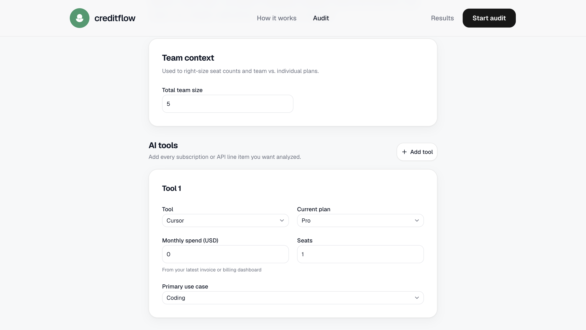
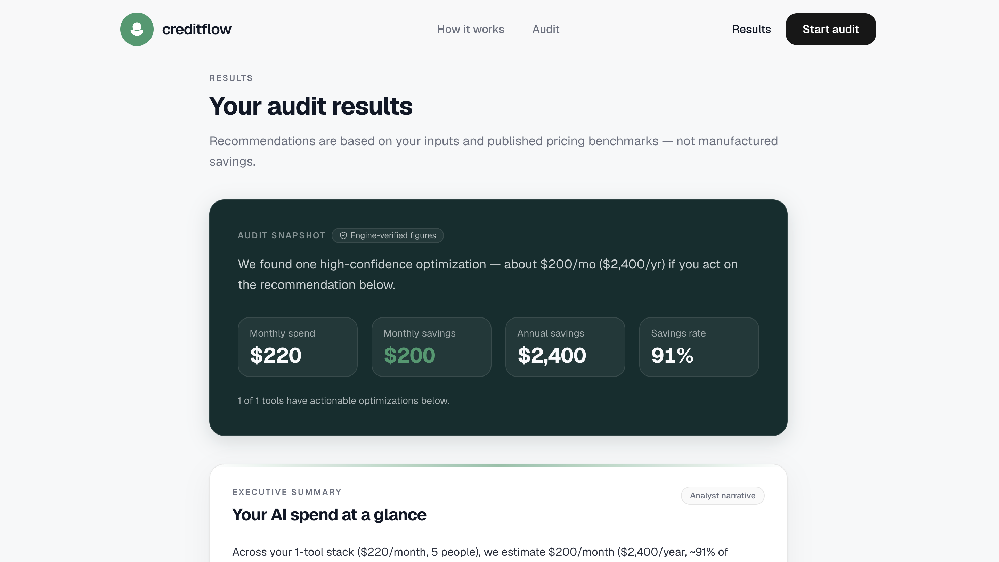
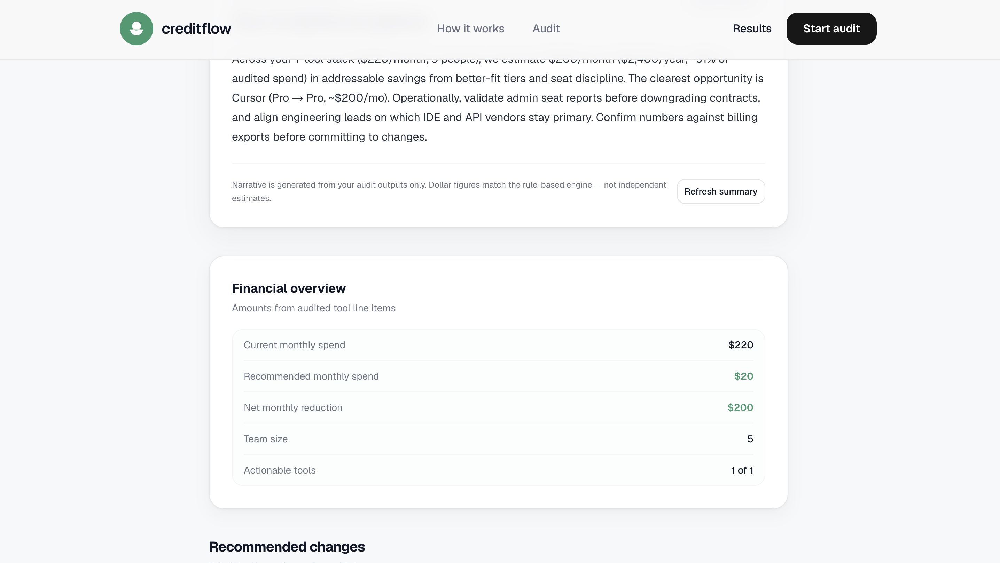
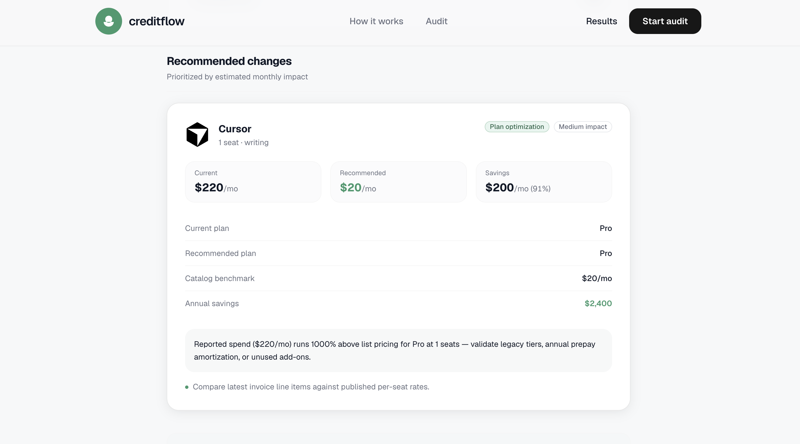
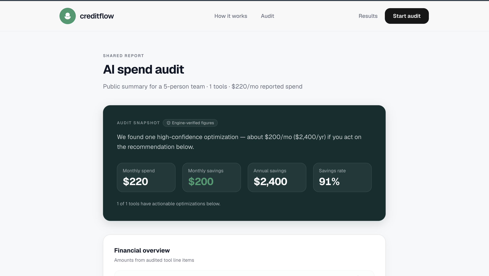
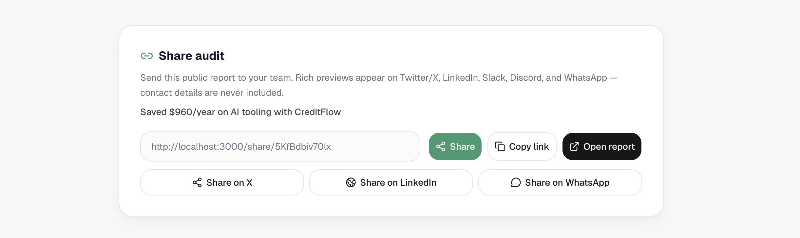

## CreditFlow

CreditFlow helps teams run an engine-verified “AI spend audit” against their current ChatGPT/Claude/Cursor/Copilot tool stack, then generates concrete recommendations and savings estimates. It stores audits in Supabase, generates a shareable public report at `/share/[id]`, and ensures social previews (Open Graph + Twitter card) render cleanly with a dynamic OG image + static fallback—without leaking lead contact details.

Deployed URL: https://creditflow-audit.vercel.app

Demo video: https://youtu.be/LPFzV2b-xyA

---

## Screenshots

> Placeholders—swap these for real images captured from your deployment.














---

## Quick Start

```bash
npm install
cp .env.example .env.local
npm run dev
```

Then open `http://localhost:3000` and run an audit to generate a `/share/[id]` link.

Or watch the [product demo walkthrough](https://youtu.be/LPFzV2b-xyA) on YouTube.

---

## Environment Setup

Create a `.env.local` based on `.env.example`:

### Required

- `NEXT_PUBLIC_APP_URL` (e.g. `https://creditflow-audit.vercel.app`)
- `NEXT_PUBLIC_SUPABASE_URL`
- `NEXT_PUBLIC_SUPABASE_PUBLISHABLE_KEY` (or `NEXT_PUBLIC_SUPABASE_ANON_KEY`)
- `SUPABASE_SERVICE_ROLE_KEY` (or `SUPABASE_SECRET_KEY`) — used server-side to persist audits
- `BREVO_API_KEY`
- `BREVO_SENDER_NAME`
- `BREVO_SENDER_EMAIL`

### Optional (AI executive summary)

- `CREDITFLOW_AI_PROVIDER`
- `OPENAI_API_KEY` and `OPENAI_SUMMARY_MODEL`
- `ANTHROPIC_API_KEY` and `ANTHROPIC_SUMMARY_MODEL`

---

## Stack

- Next.js 16 (App Router) + React + TypeScript
- Tailwind CSS + shadcn/ui components
- Supabase (audit persistence + share-id lookup)
- Brevo (transactional email for share follow-up)
- `next/og` (dynamic OG image generation for social previews)

---

## Features

- **Engine-verified audit results**
  - Audit computation is rule-based under `src/lib/audit-engine/*`
  - Results are validated and structured under `src/types/audit.ts`
- **Persisted audits + durable share IDs**
  - `POST /api/audits` creates an audit record in Supabase and returns a `shareId`
  - Public share pages load by `shareId` via `getAuditByShareId()`
- **AI executive summary (private results only)**
  - `POST /api/audit-summary` generates a narrative summary with validation/fallback
  - Public share reports explicitly disable the AI executive summary (`showAiSummary={false}`)
- **Public share reports at `/share/[id]`**
  - Rendered using only `result_data` and `estimated_savings` (no lead fields)
  - Includes share UX (copy link + open report) and a lead capture section for email delivery
- **Social preview metadata (production-ready)**
  - Dynamic `generateMetadata()` for:
    - Open Graph: title/description/image
    - Twitter card: `summary_large_image`
  - Dynamic OG image route:
    - `/share/[id]/opengraph-image`
  - Static fallback OG image route:
    - `/share/opengraph-image`
  - Share metadata is centralized in `src/lib/share/public-metadata.ts`
- **Privacy boundary**
  - The public page and metadata generation only use aggregate result fields (team size, tools, spend, savings)
  - Lead contact data (`email`, `company_name`, `role`) is never incorporated into OG/Twitter metadata or displayed on the public report

---

## Decisions (Real Trade-offs)

1. **Share-id based public access (no auth) vs. strict privacy**
   - Implemented by looking up audits with `shareId` in `getAuditByShareId()` and rendering only `row.result_data` (`src/app/share/[id]/page.tsx`).
   - Trade-off: anyone with the link can view the public report; mitigation is the render + metadata data boundary (no lead fields in the public metadata builder).

2. **Metadata context from aggregate results only**
   - The OG/Twitter description is built from aggregate fields like `teamSize`, `recommendations.length`, `totalCurrentSpend`, and annual savings (`src/lib/share/public-metadata.ts`).
   - Trade-off: social previews can’t reflect per-tool/user narrative details that might be present in private UI or lead form inputs, by design.

3. **Dynamic OG image route (`/share/[id]/opengraph-image`) vs. static-only cards**
   - The per-report OG image is rendered via `next/og` in `src/app/share/[id]/opengraph-image.tsx`.
   - Trade-off: dynamic image generation adds runtime work; mitigation is a clean static fallback route `src/app/share/opengraph-image.tsx`.

4. **Server-side persistence (Supabase service role) vs. purely client-side generation**
   - Audits are created server-side using `POST /api/audits` and persisted via `createAuditRecord()` (`src/lib/audits/repository.ts`).
   - Trade-off: requires Supabase service role configuration in the environment; mitigated by never exposing the service role to the browser.

5. **“Send email if configured” behavior vs. hard failure**
   - Lead capture calls `POST /api/audits/[shareId]/lead`; email delivery uses Brevo (`src/lib/email/send-audit-summary.ts`).
   - Trade-off: if Brevo is not configured/authorized, delivery is skipped and the UI continues (the route returns email status info, rather than blocking the share).

---

## Assumptions Made

- The (attached) assignment PDF requirements correspond to the typical Credex deliverables already implemented here:
  - Shareable public report URLs
  - Dynamic social previews (Open Graph + Twitter)
  - No private lead data leakage on public metadata/pages
- Social crawlers require absolute URLs, so `NEXT_PUBLIC_APP_URL` must be set to a publicly reachable HTTPS origin for external validators.

---


